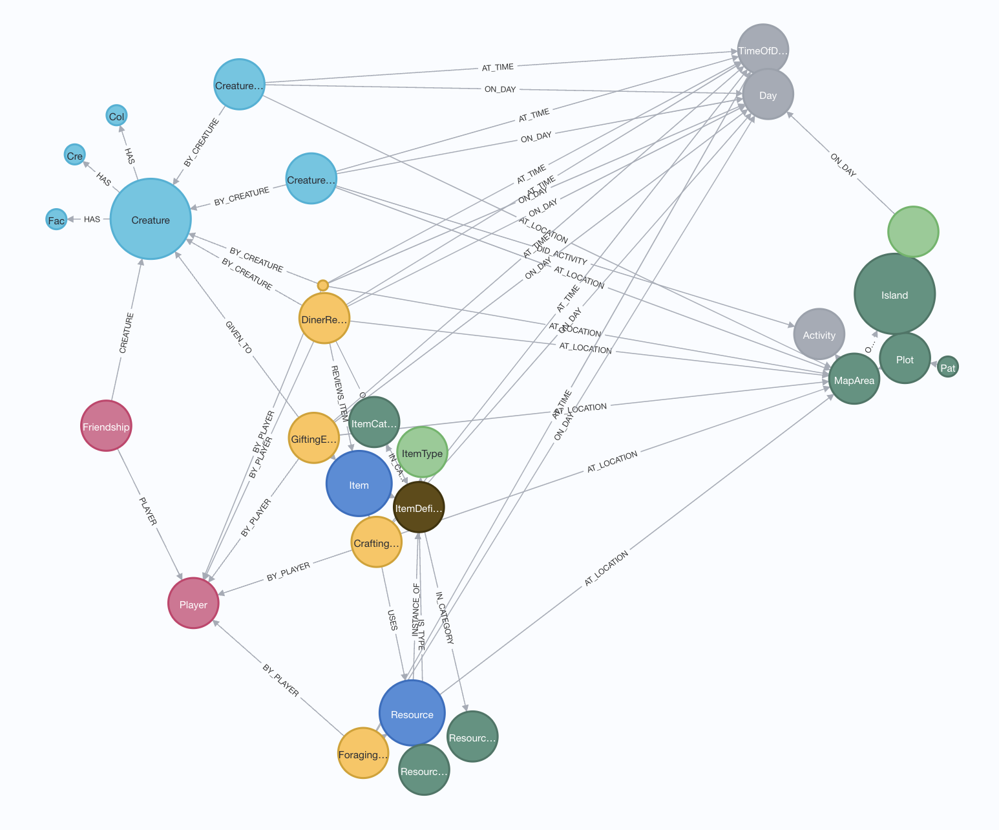
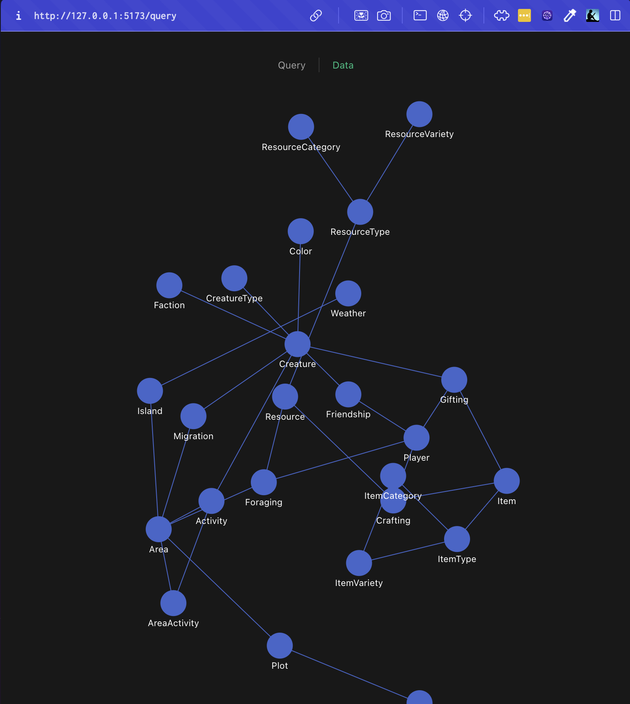

# For prototyping a game querying system
- Monorepo
- Client is Vue3
- Server is Node and Express
- Database is a local Neo4j

# Server
- The server creates a game instance and populates the game graph database with data from the FV API.
- The server provides an API to query the graph database.
- The endpoint /schema returns a schema object, and /data returns 100 data points.

## server setup
- npm install express
- npm install neo4j-driver
- npm install cors
- install neo4j database locally
- add db/password in packages/server/data/GraphDB.js
- run with 'node server.js'

# Client
- The Data view shows the response from /data in a list
- The Query view shows the response from /schema in a nodes-and-edges view, using the [v-network-graph library](https://dash14.github.io/v-network-graph/)

## client setup
- start client by cd to client
- run with 'npm run dev'
- runs on [localhost](http://localhost:5173/)

# Screenshots

Example Graph Schema Layout (in Neo4j browser):

And a Force-directed Layout of schema accessed from the /schema endpoint, shown in the Vue app:

